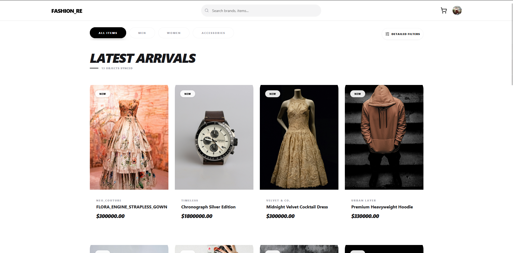
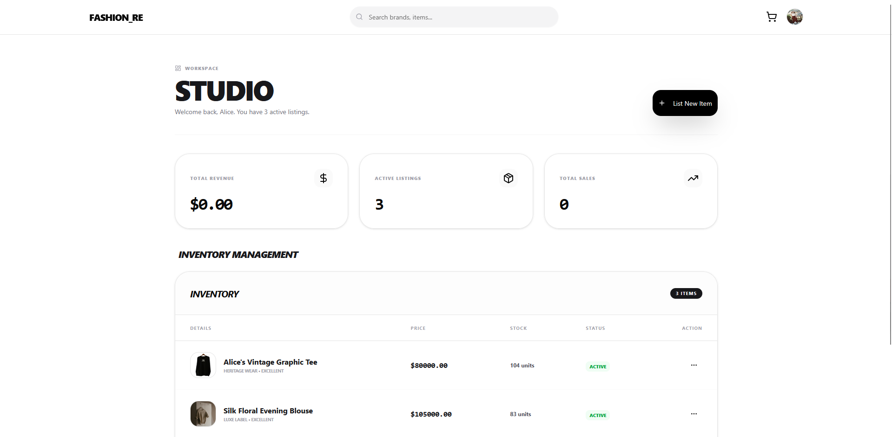
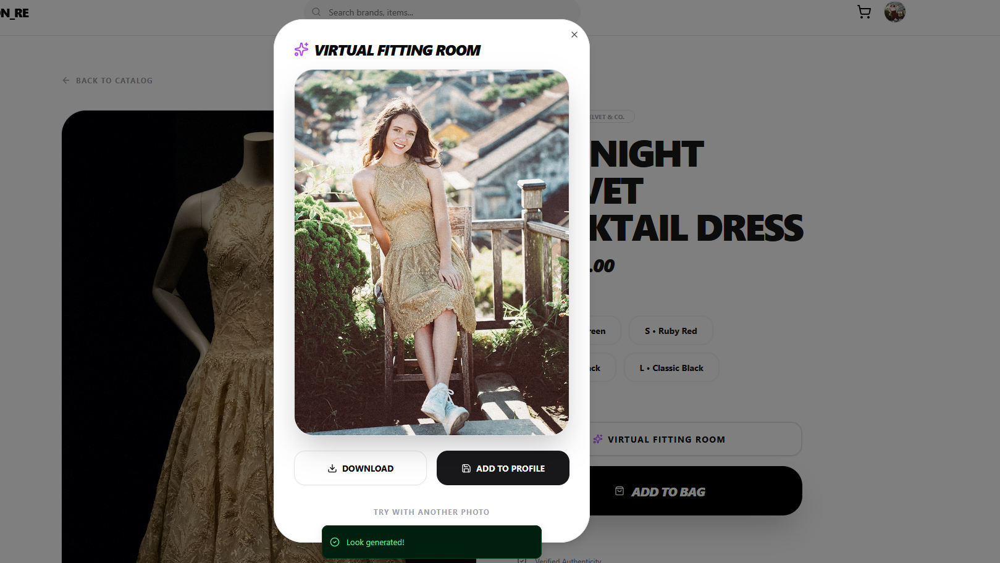
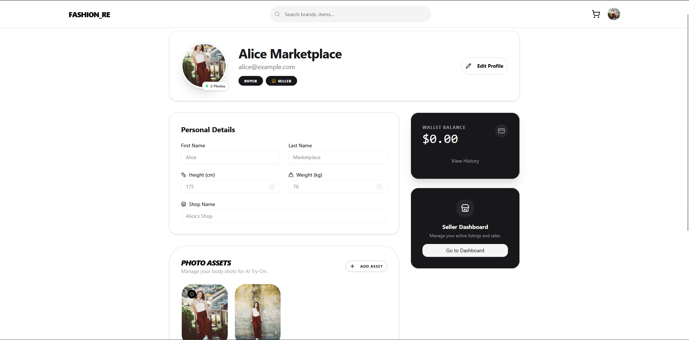

# FASHION_RE 
> **A resale marketplace built with Spring Boot and React, featuring an AI Virtual Try-On experimental tool.**

---

## 01. OVERVIEW
FASHION_RE is a full-stack e-commerce application designed for buying and selling second-hand clothing. The project explores the integration of Generative AI in retail, specifically using Large Language Models to help users visualize how clothes might look on them.

## 02. PREVIEW

### Digital Interface
| Home Feed (Synced Objects) | Seller Inventory Control |
| :---: | :---: |
|  |  |

### AI Virtual Try-On Workflow
| Step 1: Source & Selection | Step 2: AI Generated Result |
| :---: | :---: |
|  |  |

### User Experience
| Product Discovery | Secure Profile & Addresses |
| :---: | :---: |
|  |  |

## 03. FEATURES
* **AI Try-On:** An experimental feature using Virtual Try-On Preview 08-04 to synthesize an image of a user wearing a selected product.
* **Dual-Role Ecosystem:** Dedicated user flows for **Buyers** (browsing, purchasing, address management) and **Sellers** (inventory management, sales tracking, shop profile customization).
* **Search & Discovery:** Implemented a keyword-based search and hierarchical category filter to help users navigate diverse product listings efficiently.
* **Seller Inventory (CRUD):** A comprehensive dashboard allowing sellers to list new items, manage stock variants (size/color), and track active listings.
* **Flexible Payment System:**
    * **Wallet Logic:** Users can purchase items using a digital wallet funded by their own sales (store credit).
    * **VNPay Integration:** External payment processing via VNPay Sandbox for secure outside transactions.
## 04. TECH STACK
* **Frontend:** React , TypeScript, Tailwind CSS.
* **Backend:** Java , Spring Boote.
* **Database:** PostgreSQL.
* **Cloud & AI:** Google Cloud Storage, Vertex AI (Gemini).

---

## SETUP

### Backend
1. Clone the repository.
2. Update `src/main/resources/application.properties` with your PostgreSQL and Google Cloud credentials.
3. Run `mvn clean install` then `mvn spring-boot:run`.

### Frontend
1. Navigate to the frontend directory.
2. Run `npm install`.
3. Start the workspace with `npm run dev`.
